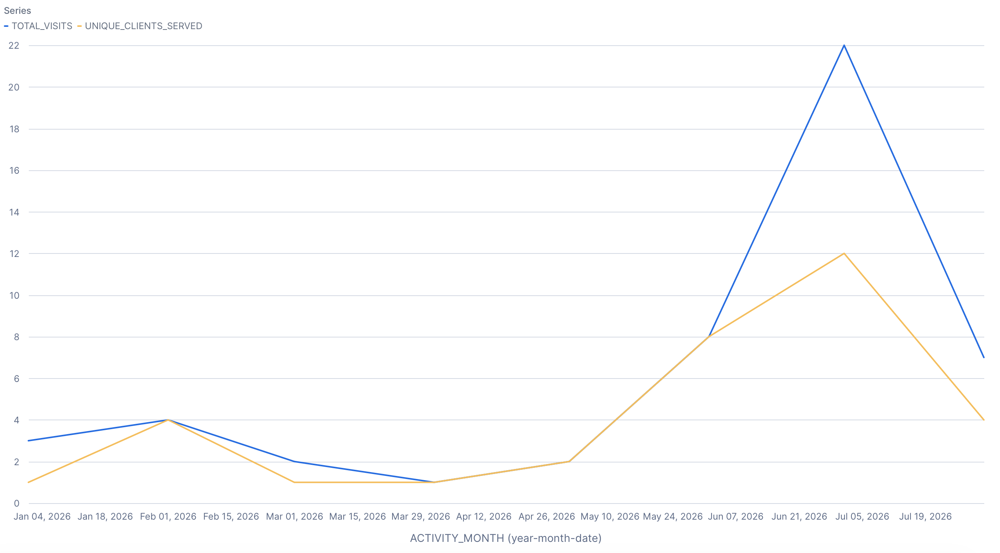
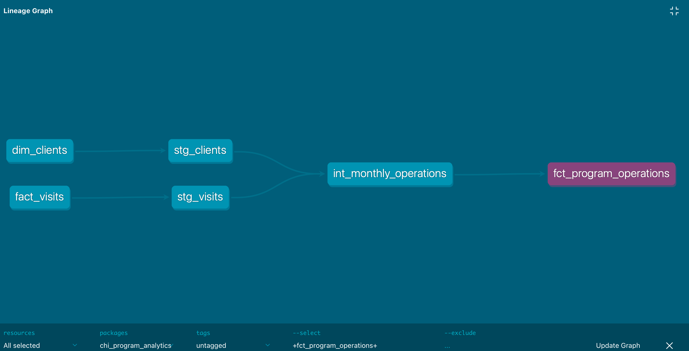
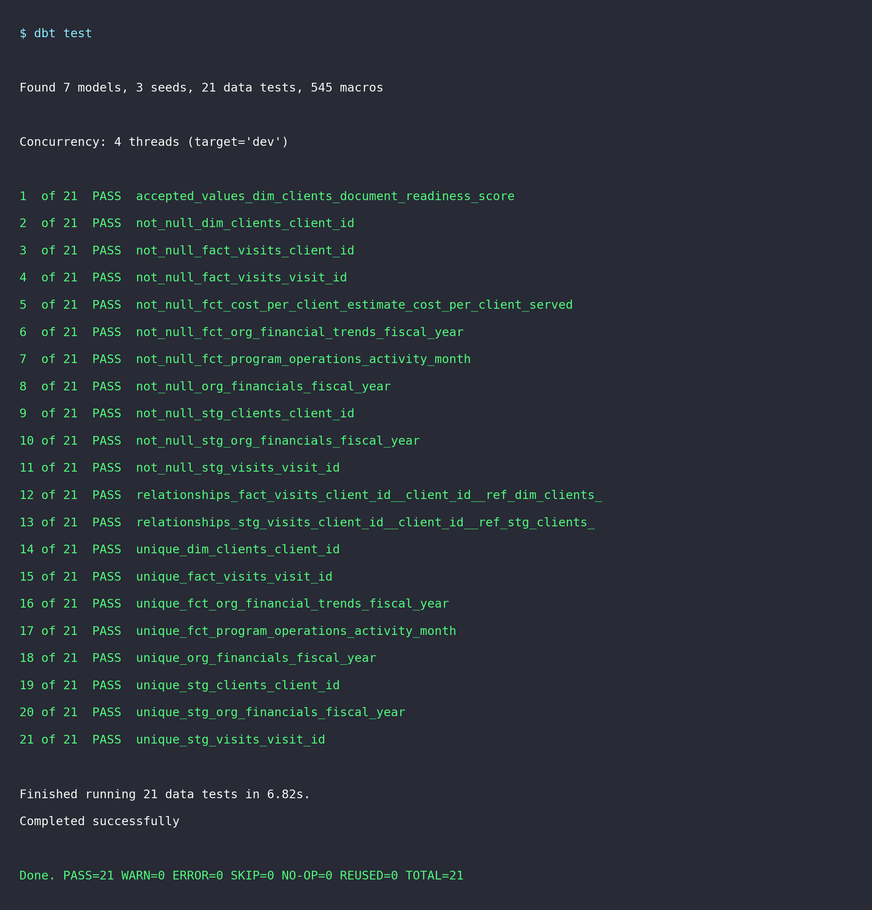
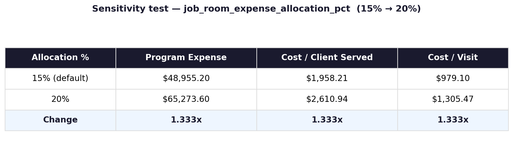

# CHI Program Analytics (using Snowflake, dbt)

FP&A / operations analytics warehouse for a nonprofit client-services program. Replaces a manual spreadsheet tracking process with a tested Snowflake + dbt pipeline, and adds a cost-per-client-served metric on top of it.

## Why

The manual tracking sheet could tell you how many clients were served in a month. It couldn't tell you what that actually costs, or whether that cost is trending up or down. That's the question this project answers.

## Tools

Snowflake, dbt Core, SQL, Python (for the anonymization script), dbt tests, dbt docs

## Process

1. Anonymized the source client/visit data (script + rules in `scripts/`)
2. Loaded anonymized data + public financial filings as dbt seeds
3. Built a 3-layer dbt pipeline: staging → intermediate → marts
4. Added 21 automated data tests (uniqueness, not-null, referential integrity, accepted ranges)
5. Built a configurable cost-allocation model for cost-per-client-served
6. Ran a sensitivity test on the allocation assumption to check the model behaves correctly
7. Charted results in Snowflake and documented lineage with dbt docs

## Results & impact

| Metric | Result |
|---|---|
| Data quality | 21/21 dbt tests passing. Fixed null/missing-month errors that existed in the source system |
| Cost model | Cost per client served and cost per visit, computed from public financials at a configurable allocation rate |
| Model integrity | Sensitivity test: moving the allocation from 15% to 20% moved both cost outputs by exactly 1.33x, so the model scales correctly and isn't hiding a bug |
| Reusability | Manual spreadsheet swapped for a version-controlled pipeline that can just be re-run |

Full write-up: [`docs/CHI_Project_Case_Study.md`](docs/CHI_Project_Case_Study.md)

## Screenshots

**Monthly clients served vs. visits, Snowflake native chart**


**Pipeline lineage, from dbt docs**


**21/21 data tests passing**


**Sensitivity test, 15% vs. 20% allocation**


Raw query output behind that image: [`results/sensitivity_test_15pct_allocation.csv`](results/sensitivity_test_15pct_allocation.csv) and [`results/sensitivity_test_20pct_allocation.csv`](results/sensitivity_test_20pct_allocation.csv).

## Repo structure

```
├── models/
│   ├── staging/          1:1 cleaned source tables
│   ├── intermediate/     reusable aggregation logic
│   └── marts/            final BI-ready, tested tables
├── seeds/                anonymized source data (see scripts/)
├── scripts/              anonymization script + rules
├── images/               screenshots referenced in this README
├── results/              raw query output behind the sensitivity test
├── docs/                 full case study (md / pdf)
├── dbt_project.yml
├── profiles_example.yml  connection template, never commit real credentials
└── LICENSE
```

## Setup

```bash
pip install dbt-core dbt-snowflake
cp profiles_example.yml ~/.dbt/profiles.yml   # fill in your Snowflake credentials
dbt seed
dbt run
dbt test
dbt docs generate && dbt docs serve
```

## Data & privacy

Everything client-level here is anonymized: no names, contact info, addresses, or free-text notes, and IDs are re-issued so they can't be traced back to the source records. Financial numbers come from CHI's public IRS Form 990 filings (ProPublica Nonprofit Explorer, EIN 45-2542979), which is public record. Full details in [`scripts/anonymize_chi_data.py`](scripts/anonymize_chi_data.py).
